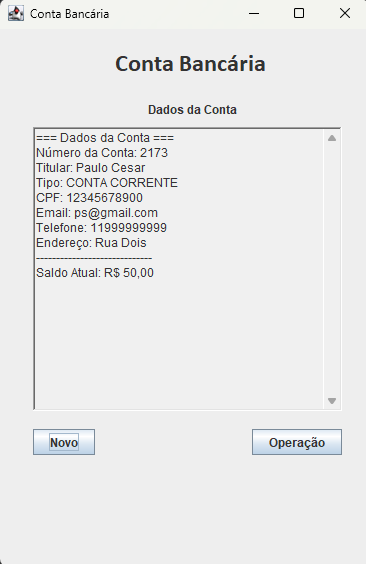
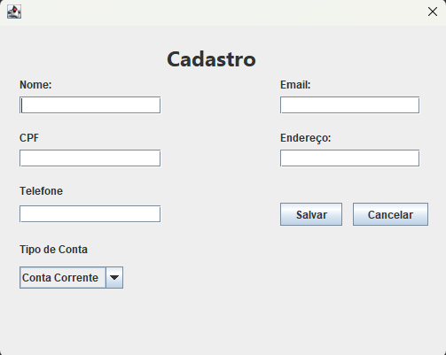
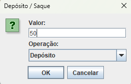

# 🏦 Gerenciador de Contas Bancárias

Um sistema simples desenvolvido em **Java (Swing)** com foco na **lógica de back-end**.  
O objetivo principal é **demonstrar o funcionamento interno de um sistema bancário**, aplicando conceitos de **Programação Orientada a Objetos (POO)**, como encapsulamento, classes controladoras e interação entre objetos.  

> O foco deste projeto é **demonstrar a estrutura e funcionamento do back-end**, **não o design da interface gráfica**.

---

## Funcionalidades

- Criação de contas bancárias com:
  - Número da conta  
  - Tipo (Conta Corrente ou Conta Poupança)  
  - Nome do titular  
- Depósito e saque com validações de saldo  
- Encerramento de conta  
- Controle de status (ativa/inativa)  
- Uso de **Controller** para centralizar as operações e gerenciar as contas criadas  

---

## Conceitos aplicados

- **Programação Orientada a Objetos (POO)**  
  - Encapsulamento  
  - Associação entre classes (`ContaBanco`, `DonoConta`, `Controller`)  
- **MVC simplificado** — separação entre lógica, controle e interface  
- Manipulação de **caixas de diálogo (`JOptionPane`)**  
- Utilização de listas e controle de objetos em memória  

---

## Estrutura do Projeto

- `ContaBanco.java` → Representa a conta bancária e suas operações.  
- `DonoConta.java` → Modela o titular da conta.  
- `Controller.java` → Gerencia as contas e centraliza a lógica de negócio.  
- `TelaPrincipal.java` → Interface principal do sistema.  
- `DialogCriarConta.java` → Tela para criação de novas contas.  

---

## Prints da Interface

| Tela Principal | Criação de Conta | Depósito/Saque |
|----------------|------------------|----------------|
|  |  |  |

> As imagens podem ser encontradas na pasta `/prints` deste repositório.  

---

## 👤 Autor

Desenvolvido por **Paulo Cesar**  
📧 [PauloCesarCoder@gmail.com](mailto:PauloCesarCoder@gmail.com)  
🌐 [GitHub](https://github.com/paulo-czr)  
💼 [Meu LinkedIn](https://www.linkedin.com/in/paulo-czr)

---

## Observação

Este projeto foi desenvolvido com fins **educacionais**, com ênfase no **entendimento da lógica e estrutura do back-end** de um sistema bancário, **sem persistência em banco de dados**.
